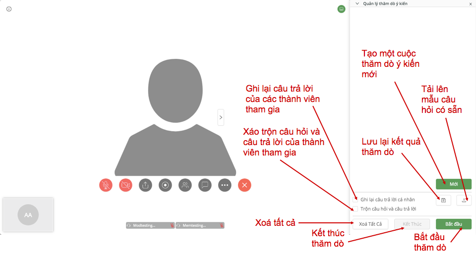

# HƯỚNG DẪN SỬ DỤNG HOPEZ DÀNH CHO QUẢN LÝ NHÓM

## I. Hướng dẫn đăng ký

##### Bước 1: Truy cập [hopez.io](https://hopez.io/).

_Giao diện hopez.io_

##### Bước 2: Tiến hành đăng ký tài khoản. Có 2 cách [đăng ký](https://hopez.io/cfr/signup).

<!---
###### Cách 1: Đăng ký bằng cách sử dụng tài khoản Google của bạn.

_Nhấn “Sign in with Google” để đăng ký bằng tài khoản Google của bạn._

- Đầu tiên, nhấn chọn “Sign in with Google".
- Nếu đã đăng nhập tài khoản Google trước đó trong trình duyệt, bạn chỉ cần nhấn chọn tài khoản của bạn và hệ thống sẽ tự động đăng nhập.
- Nếu chưa đăng nhập tài khoản Google, bạn sẽ được dẫn đến giao diện đăng nhập của Google. Tiến hành điền thông tin và đăng nhập để bắt đầu sử dụng Hopez.

###### Cách 2: Đăng ký trực tiếp tài khoản tại hopez.io
--->

_Nhấn [“tại đây"](https://hopez.io/cfr/signup) nếu bạn muốn đăng ký tài khoản trực tiếp tại Hopez._

- Nhấn vào chữ [“tại đây"](https://hopez.io/cfr/signup) tại dòng cuối giao diện.
- Điền Thông tin cá nhân:
- Tên đăng nhập: tên bạn sử dụng để đăng nhập Hopez.
- Họ và tên đệm của bạn.
- Tên của bạn.
- Số điện thoại của bạn
- Điền thông tin hộp thư điện tử của bạn (Email).
- Tạo mật khẩu đăng nhập. Bạn cần lưu ý tạo mật khẩu tuân theo các nguyên tắc sau để đảm bảo bảo mật.
- Có ít nhất 8 ký tự.
- Có ít nhất một chữ cái (a, b, c…).
- Có ít nhất một số (1, 2, 3…).
- Phải bao gồm ký tự in hoa và chữ thường.
- Không được đặt mật khẩu chỉ chứa một ký tự duy nhất như 1111111111 hoặc aaaaaaaaa, hoặc các ký tự liên tiếp như abcdefgh hoặc 123456789.
- Đọc kỹ Điều khoản dịch vụ và Chính sách dịch vụ, sau đó nhấn chọn vào ô “Tôi đồng ý với Hopez Điều khoản dịch vụ và Chính sách dịch vụ).
- Nhấn ĐĂNG KÝ.
- Bạn sẽ nhận được thông báo Đăng ký thành công ở góc trên bên phải giao diện.

_Điền đầy đủ thông tin để tiến hành đăng ký._

###### Bước 3. Kích hoạt tài khoản hopez.io bằng cách truy cập vào email bạn vừa đăng ký và kích hoạt theo hướng dẫn.

## II. Hướng dẫn sử dụng Hopez

### PHẦN DÀNH CHO CÁ NHÂN

_Giao diện Hopez khi mới bắt đầu đăng nhập và sử dụng._

#### 1. Quản lý hồ sơ

**Thay đổi ảnh đại diện**

- Nhấn chọn ‘thay đổi'.
- Nhấn ‘add something' (lưu ý chọn hình có dung lượng không quá 2MB).
- Nhấn ‘Lưu'.

_Thay đổi ảnh đại diện bằng cách nhấn vào “Thay đổi"._

**Thay đổi thông tin người dùng.**

- Nhấn “Sửa" (khoanh đỏ bên dưới).
- Thay đổi họ và tên đệm, tên.
- Thay đổi địa chỉ email.
- Thay đổi số điện thoại.
- Nhấn “Lưu thay đổi" nếu bạn muốn lưu lại thông tin mới. Nhấn “Huỷ" nếu bạn muốn giữ lại thông tin ban đầu.

_Thay đổi thông tin người dùng._

**Thay đổi mã của cuộc họp cá nhân**

- Nhấn ‘sửa'.
- Gõ mã code cuộc họp cá nhân mới.
- Nhấn ‘Lưu thay đổi'.

_Nhấn “Sửa" để thay đổi mã cuộc họp cá nhân._

**Thay đổi mật khẩu.**

- Nhấn “Sửa" (khoanh đỏ bên dưới).
- Điền mật khẩu cũ.
- Điền mật khẩu mới.
- Nhấn “Lưu thay đổi” để lưu lại mật khẩu mới.

_Thay đổi mật khẩu trên Hopez._

#### 2. Quản lý cuộc họp

Để tạo một cuộc họp mới, nhấn vào ‘Tạo mới cuộc họp'.

_Hướng dẫn tạo mới cuộc họp trên Hopez_.

Điền đầy đủ các thông tin theo yêu cầu, bao gồm:

- Chủ đề: Tên cuộc họp của bạn.
- Mô tả: Mô tả nội dung sơ lược về cuộc họp của bạn.
- Bắt đầu lúc: Thời gian bao gồm ngày giờ bắt đầu cuộc họp.
- Thời lượng: Thời gian dự kiến cuộc họp của bạn diễn ra trong bao lâu.
- Mật khẩu: Bạn có thể đặt mật khẩu cho cuộc họp để tăng tính bảo mật. Chỉ những ai biết mật khẩu mới có thể tham gia cuộc họp. Nếu không cần, bạn có thể bỏ qua phần này.
- Video: Ở đây, bạn có thể lựa chọn bật/tắt video cho chủ phòng và những người tham gia cuộc họp.

Sau đó, nhấn Lưu để tạo mới cuộc họp.

_Điền đầy đủ thông tin để tạo mới cuộc họp._

Sau khi nhấn Lưu, bạn sẽ được dẫn đến trang thông tin cuộc họp. Tại đây, bạn có thể xem lại toàn bộ thông tin về cuộc họp bạn đã tạo. Bạn có thể thay đổi thông tin bằng cách nhấn “Chỉnh sửa cuộc họp" hoặc tiến hành họp bằng cách nhấn “Bắt đầu cuộc họp".

Mời thành viên: Nhấn vào “Mời thành viên" để mời ngừoi tham gia cuộc họp.

Lấy đường dẫn: Lấy đường dẫn dẫn về cuộc họp bạn đã tạo.

Thành viên: Xem danh sách tất cả các thành viên tham gia cuộc họp vừa tạo.

Thống kê: Tại đây, bạn có thể xem chi tiết các dữ liệu được phân loại theo “Khảo sát" (câu hỏi trong cuộc họp) hoặc “Điểm danh" (những người tham gia họp).

Nếu bạn muốn xoá cuộc họp, nhấn “Xoá cuộc họp".

_Giao diện chỉnh sửa cuộc họp tại Hopez._

Xem danh sách cuộc họp đang diễn ra: Nhấn chọn “Cuộc họp đang diễn ra" để xem danh sách các cuộc họp đang diễn ra tại thời điểm bạn dùng Hopez.

Xem danh sách các cuộc họp trong tương lai: Nhấn chọn “Cuộc họp sắp tới" để xem danh sách các cuộc họp sẽ diễn ra trong thời gian tới.

Xem lại danh sách các cuộc họp đã hoàn thành: Nhấn chọn “Các cuộc họp đã kết thúc".

#### 3. Quản lý bản ghi

Bản ghi lưu trữ toàn bộ thông tin được ghi lại từ cuộc họp. Bạn có thể tìm kiếm bản ghi bằng cách nhập tên cuộc họp và mã cuộc họp vào ô tìm kiếm bên phải.

_Tìm kiếm và quản lý bản ghi cuộc họp._

Để lọc bản ghi đã được phân loại: Nhấn vào “Lọc bản ghi".

- Tất cả: Liệt kê tất cả các bản ghi bạn có được.
- Chia sẻ với tôi: Các bản ghi của các thành viên khác đã chia sẻ quyền với bạn.
- Bản ghi của tôi: Bản ghi bạn đã ghi lại.

_Lọc bản ghi giúp bạn phân loại bản ghi của bạn và bản ghi bạn được chia sẻ quyền._

#### 4. Quản lý nhóm

Để tạo mới nhóm, nhấn chọn “Thêm nhóm".

_Hướng dẫn tạo nhóm mới trên Hopez._

Điền đầy đủ thông tin để tạo nhóm:

- Tên nhóm: Tên nhóm của bạn.
- Mô tả: Thông tin mô tả nhóm của bạn.
- Nhấn “Thêm" để tạo mới. Hoặc “Huỷ" để huỷ bỏ tạo nhóm.

Để xoá nhóm, nhấn “Xoá”. Tiếp tục chọn “Xoá" để xoá nhóm vĩnh viễn hoặc “Huỷ" để quay trở lại ban đầu.

_Hướng dẫn xoá nhóm trên Hopez._

Để tìm kiếm nhóm của bạn. Nhấn tìm kiếm theo tên nhóm ở khung tìm kiếm nằm ở góc trên bên trái (khoanh đỏ như hình).

_Hướng dẫn tìm kiếm nhóm tại Hopez._

Để lọc danh sách nhóm: Nhấn chọn “Bộ lọc".

- Nhóm tôi quản lý: Danh sách nhóm bạn đã tạo.
- Nhóm tôi tham gia: Danh sách nhóm các thành viên khác tạo và bạn đang tham gia các nhóm này.

### PHẦN DÀNH CHO QUẢN TRỊ VIÊN

#### 1. Quản lý người sử dụng

Để xem danh sách người dùng, nhấn chọn thẻ “Danh sách người dùng". Danh sách người dùng được liệt kê theo tên, email, tài khoản và vai trò.

Để sắp xếp theo hạng mục nào, bạn chỉ cần nhấn vào thẻ hạng mục đó để sắp xếp. Ví dụ, bạn muốn sắp xếp danh sách người dùng theo tài khoản, nhấn chọn thẻ “Tài khoản", danh sách người dùng sẽ được sắp xếp theo thứ tự từ A-Z hoặc ngược lại theo tài khoản.

_Quản lý danh sách người dùng tại Hopez._

Để tìm kiếm người dùng, gõ tên người dùng vào ô tìm kiếm. Bạn có thể tìm kiếm ngừoi dùng theo tên, tên đăng nhập hoặc email của họ.

Ngoài ra, bạn có thể tìm kiếm người dùng bằng cách sử dụng công cụ tìm kiếm nâng cao.

- Nhấn chọn “Tìm kiếm nâng cao".
- Tất cả vai trò: tìm kiếm ngừoi dùng theo vai trò của họ.
- Tất cả nhóm: tìm kiếm người dùng theo những nhóm mà họ đã tham gia.

Để thay đổi cách thức hiển thị, nhấn vào biểu tượng bánh răng cưa ở góc trên bên phải giao diện.

Đánh dấu tick vào hạng mục bạn mong muốn hiển thị hoặc bỏ tick nếu bạn không muốn hạng mục đó hiển thị trên danh sách. Nhấn “Xác nhận" để lưu lại thay đổi hiển thị.

Để tạo mới người dùng, nhấn chọn “Tạo mới người dùng".

Điền đầy đủ các thông tin theo yêu cầu để tạo mới người dùng.

- Họ và tên đệm.
- Tên.
- Tài khoản.
- Mật khẩu. (Mật khẩu cần được đặt như quy định khi tạo tài khoản Hopez).
- Email.
- Số điện thoại.
- Role user: Vai trò của người dùng (Admin, mod, member, Bot record).
- Nhóm.

Sau đó nhấn “Lưu" để tạo mới ngừoi dùng hoặc “Huỷ" để huỷ toàn bộ quá trình tạo mới người dùng.

_Hướng dẫn tạo mới người dùng dành cho quản lý nhóm tại Hopez._

Để xoá ngừoi dùng, nhấn “Xoá". Tiếp tục chọn “Xoá" nếu bạn muốn xoá người dùng hoặc “Huỷ" để huỷ quá trình xoá.

Để xem danh sách chờ duyệt. Nhấn chọn thẻ “Danh sách chờ duyệt". Tại đây, bạn có thể duyệt người dùng bằng cách nhấn “Xác nhận". Ngoài ra, bạn có thể loại người dùng khỏi danh sách chờ duyệt bằng cách nhấn “Huỷ”.

Để sắp xếp theo hạng mục nào, bạn chỉ cần nhấn vào thẻ hạng mục đó để sắp xếp. Ví dụ, bạn muốn sắp xếp danh sách chờ duyệt theo tài khoản, nhấn chọn thẻ “Tài khoản", danh sách người dùng sẽ được sắp xếp theo thứ tự từ A-Z hoặc ngược lại theo tài khoản.

Để thay đổi cách thức hiển thị, nhấn vào biểu tượng bánh răng cưa ở góc trên bên phải giao diện.

Đánh dấu tick vào hạng mục bạn mong muốn hiển thị hoặc bỏ tick nếu bạn không muốn hạng mục đó hiển thị trên danh sách. Nhấn “Xác nhận" để lưu lại thay đổi hiển thị.

### HƯỚNG DẪN HỌP TRÊN HOPEZ

Để bắt đầu cuộc họp trên Hopez, sau khi đã tạo mới cuộc họp, nhấn vào “Bắt đầu" để tiến hành họp.

Cho phép Hopez sử dụng Microphone và Camera của bạn.

**Tùy chỉnh hiển thị người tham gia cuộc họp**

- Không hiển thị người tham gia: Bạn sẽ không thấy được camera của tất cả thành viên tham gia trên màn hình.
- Hiển thị người tham gia trên toàn màn hình: Bạn sẽ thấy được toàn bộ camera của tất cả các thành viên tham gia cuộc họp trên toàn bộ màn hình.
- Hiển thị người tham gia ở dưới màn hình: Camera của toàn bộ thành viên tham gia cuộc họp sẽ được hiển hị bên dưới các nút tính năng chính của cuộc họp.

Giao diện cuộc họp

- Hình chữ nhật góc dưới bên phải: khung hiển thị camera của bạn. Nếu bạn bật chế độ camera, hình ảnh của bạn sẽ hiện lên tại đây.
- Microphone: Nhấn để bật/tắt microphone của bạn. Nếu biểu tượng có dấu gạch chéo màu đỏ, microphone đang tắt. Biểu tượng có màu xám, không có dấu gạch chéo, microphone đang mở.
- Camera: Nhấn để bật/tắt camera. Nếu biểu tượng có dấu gạch chéo màu đỏ, camera đang tắt. Biểu tượng có màu xám, không có dấu gạch chéo, camera đang mở.

- Chia sẻ màn hình: Đây là chức năng giúp bạn chia sẻ màn hình đến tất cả các thành viên tham gia cuộc họp. Nhấn nút (như chỉ dẫn) để chọn chia sẻ màn hình. Bạn có thể chọn 3 cách chia sẻ bao gồm: Chia sẻ toàn bộ màn hình, chia sẻ cửa sổ ứng dụng, chỉ chia sẻ một tab của trình duyệt web bạn đang dùng. Sau đó nhấn Share để tiến hành chia sẻ màn hình đến toàn bộ thành viên tham gia cuộc họp.

- Ghi hình cuộc họp. Nhấn “Ghi hình" để tiến hành ghi hình cuộc họp. Nội dung ghi sẽ được lưu lại tại mục Quản lý bản ghi.

- Nhấn “Người tham gia" để xem danh sách những thành viên tham gia cuộc họp của bạn. Tại đây, bạn có thể chủ động bật/tắt camera hoặc microphone của họ bằng cách nhấn vào biểu tượng camera và microphone cạnh bên tên thành viên.

Nhấn “Tin nhắn" để xem nội dung chat và chat trực tiếp với các thành viên trong cuộc họp.

Nhấn vào dấu ba chấm để sử dụng các chức năng trong cuộc họp.

**Tính năng phân quyền**

Phân quyền cho phép bạn tuỳ chỉnh các quyền của người tham gia cuộc họp. Chủ phòng là người có mọi quyền trong cuộc họp và có quyền cấp quyền hoặc huỷ quyền của người thuyết trình hoặc người tham dự cuộc họp.

Các quyền trong cuộc họp bao gồm: Chia sẻ giọng nói; Chia sẻ hình ảnh; Chia sẻ ứng dụng; Trò chuyện; Thay đổi giọng nói cả phòng; Chặn người dùng chia sẻ giọng nói; Chặn người dùng chia sẻ hình ảnh; Điều khiển mic-cam thành viên khác trong chế độ lớp học; Ghim người dùng chính; Ghim người dùng phụ; Xoá người dùng; Kick người dùng; Ghi hình buổi họp; Tạo đồng hồ đếm giờ; Làm mới đồng hồ đếm giờ; Tạo thăm dò ý kiến; Khoá/mở thăm dò ý kiến; Làm mới thăm dò ý kiến; Xoá thăm dò ý kiến; Xem kết quả thăm dò ý kiến; Tham gia bỏ phiếu; Phân quyền.

Đây là tất cả các quyền của chủ phòng và chủ phòng có thể trao những quyền này cho các thành viên tham gia cuộc họp. Thanh kéo xanh có nghĩa bạn đang trao quyền cho các thành viên và thanh kéo xám có nghĩa bạn không trao quyền. Nhấn “Lưu thay đổi" để lưu lại thay đổi phân quyền của bạn dành cho các thành viên trong cuộc họp.

**Tính năng khoá/mở khoá phòng họp**

Tính năng khoá phòng họp cho phép bạn khoá phòng họp và các thành viên dù đã được mời tham gia (nhưng vẫn chưa tham gia họp) sẽ không thể tham gia cuộc họp trừ khi bạn mở khoá trở lại.

Thông báo các thành viên sẽ nhận được khi cố gắng tham gia một cuộc họp đã bị chủ phòng khoá

**Tính năng mời và nhắc nhở**

Tính năng mời và nhắc nhở cho phép bạn mời thêm người tham gia cuộc họp ngay trong lúc cuộc họp đang diễn ra. Bạn cần điền email của người được mời và nhấn gửi để gửi thư mời tham gia cuộc họp.

**Tính năng quản lý và thăm dò ý kiến**

Tính năng quản lý và thăm dò ý kiến cho phép bạn lấy được ý kiến của tất cả người tham gia cuộc họp, từ đó thu thập được các dữ kiện cuộc họp cần thiết.

- Để tạo mới một cuộc thăm dò ý kiến, nhấn “Mới".
- Để upload mẫu câu hỏi thăm dò bạn đã có sẵn, nhấn chọn “Upload" (dấu mũi tên hướng lên trên).
- Để lưu lại cuộc thăm dò, nhấn “Lưu" (hình chiếc đĩa mềm).
- Để ghi lại câu trả lời của các thành viên tham gia, nhấn tick vào ô “Ghi lại câu trả lời cá nhân".
- Để xáo trộn câu hỏi và câu trả lời của thành viên tham gia, nhấn tick vào ô “Trộn câu hỏi và câu trả lời".
- Để xoá toàn bộ cuộc thăm dò, nhấn “Xoá Tất Cả".
- Để kết thúc cuộc thăm dò, nhấn “Kết thúc".
- Để bắt đầu thăm dò, nhấn chọn “Bắt đầu".

**Tính năng quản lý điểm danh**

Đây là tính năng cho phép bạn điểm danh các thành viên tham gia cuộc họp theo thứ tự thời gian.

Để tiến hành điểm danh thành viên, nhấn “Bắt đầu". Ngay lập tức, màn hình sẽ hiện ra danh sách các thành viên được mời tham gia cuộc họp và điểm danh theo thứ tự người đó nhấn nút “Điểm danh" có trên màn hình.

Nhấn “Kết thúc" để kết thúc và lưu lại điểm danh.

Sau khi kết thúc điểm danh, danh sách các thành viên đã điểm danh sẽ được lưu lại theo đúng thứ tự thời gian đã điểm danh từ sớm nhất đến muộn nhất.

**Tính năng quản lý hỏi và đáp**

Tính năng quản lý hỏi và đáp cho phép các thành viên tham gia cuộc họp đặt câu hỏi cho bạn và bạn là người đưa ra câu trả lời cho toàn bộ thành viên tham gia cuộc họp.

Để sử dụng tính năng, nhấn chọn Quản lý hỏi và đáp. Tại đây, nếu muốn kiểm duyệt câu hỏi của thành viên trước khi chính thức công khai đăng câu hỏi lên cuộc họp, bạn có thể nhấn tick vào ô “Kiểm duyệt câu hỏi". Để tiến hành cuộc hỏi đáp, chọn “Bắt đầu".

Để trả lời câu hỏi, gõ câu trả lời vào ô và nhấn gửi.
Nếu bạn không muốn công khai câu trả lời cho toàn bộ thành viên mà chỉ người đặt câu hỏi mới có thể thấy được, nhấn tick vào ô “Câu trả lời cá nhân".
Nhấn “Kết thúc" để kết thúc cuộc hỏi đáp.

**Tính năng quản lý chia sẻ tập tin**

Đây là tính năng cho phép bạn quản lý và chia sẻ tập tin trong toàn bộ cuộc họp. Để sử dụng tính năng này, nhấn chọn “Quản lý và chia sẻ tập tin".

Giao diện quản lý và chia sẻ tập tin hiện ra ngay lập tức. Tại thẻ “Tất cả tập tin", bạn có thể theo dõi và quản lý toàn bộ các tập tin được tải lên và chia sẻ trong cuộc họp.

Để tải tập tin lên, nhấn chọn “Tập tin của tôi", sau đó nhấn vào nút ở góc phải màn hình để tải và chia sẻ tập tin từ máy tính của bạn.

Sau khi tải tập tin từ máy, file tập tin sẽ hiện ra. Cạnh bên tên tập tin chính là 3 tính năng để bạn quản lý tập tin.

- Chia sẻ tập tin lên cuộc họp. Khi lựa chọn chia sẻ, tất cả các thành viên cuộc họp sẽ ngay lập tức thấy được tập tin này.
- Tải tập tin về máy.
- Xoá tập tin. Xoá tập tin sẽ dẫn đến việc toàn bộ các thành viên đều sẽ không xem được tập tin này nữa.

**Tính năng sao chép đường dẫn phòng họp**

Tính năng này giúp bạn dễ dàng chia sẻ cuộc họp đến những người bạn muốn mời tham gia chỉ bằng đường dẫn URL cuộc họp. Nhấn vào “Sao chép đường dẫn phòng họp", ngay lập tức URL cuộc họp sẽ được sao chép vào bộ nhớ tạm của máy bạn.

**Tính năng loa, microphone**

Tính năng này cho phép bạn tuỳ chỉnh các thiết lập liên quan đến loa, microphone và camera của bạn.

Tại đây, bạn có thể điều chỉnh âm lượng của loa, microphone và tuỳ chỉnh camera trên máy tính của mình.

Nhấn “Kiểm tra" để kiểm tra chất lượng microphone và loa của bạn.

**Tính năng phát trực tuyến**

Tính năng phát trực tuyến cho phép bạn phát trực tuyến cuộc họp của mình trên Youtube (live-stream). Chỉ cần nhập mã phát trực tuyến và nhấn “Bắt đầu phát trực tuyến" để tiến hành live-stream.

**Rời cuộc họp**

Để thoát khỏi cuộc họp, nhấn chọn “Rời phòng".

